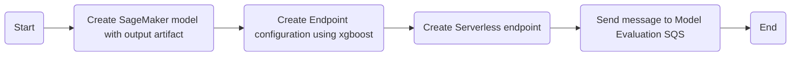

# AWS Lambda Model Deployment

[](https://www.python.org/downloads/release/python-3121/)
[](https://github.com/kwame-mintah/aws-lambda-model-deployment/actions/workflows/bump-repository-version.yml)
[](https://github.com/kwame-mintah/aws-lambda-model-deployment/actions/workflows/push-docker-image-to-aws-ecr.yml)
[](https://github.com/kwame-mintah/aws-lambda-model-deployment/actions/workflows/run-python-linter.yml)
<a href="https://github.com/psf/black"></a>

A lambda to deploy a model via serverless after training has completed. The model artifacts will be used to create a new model,
endpoint configuration and serverless endpoint configuration within SageMaker.

This repository does not create other necessarily resources within AWS, this is created via Terraform found here [terraform-aws-machine-learning-pipeline](https://github.com/kwame-mintah/terraform-aws-machine-learning-pipeline).
For more details on the entire flow and how this lambda is deployed, see [aws-automlops-serverless-deployment](https://github.com/kwame-mintah/aws-automlops-serverless-deployment).

# Flowchart

The [diagram below](https://mermaid.js.org/syntax/flowchart.html#flowcharts-basic-syntax) demonstrates what happens when the lambda is trigger, when a new `.tar.gz` object has been uploaded to the S3 Bucket.



# Notice

Please note because the SageMaker endpoint deployed is serverless, means [`DataCaptureConfig`](https://docs.aws.amazon.com/sagemaker/latest/dg/model-monitor-data-capture-endpoint.html),
is not supported and will have to rely on CloudWatch logs as per official [documentation](https://docs.aws.amazon.com/sagemaker/latest/dg/serverless-endpoints-monitoring.html).

Because endpoint(s) and endpoint configuration(s) are not created via Terraform, these will not be deleted when
destroying the environment and will need to be deleted manually or programmatically, for example if the new model is
not perform as expected, delete all related configurations created for inference.

If Terraform has destroyed all related infrastructure related to SageMaker, for example S3 bucket containing model output
has been deleted, then you are unable to invoke the endpoint because the model no longer exists.

## Development

### Dependencies

- [Python](https://www.python.org/downloads/release/python-3121/)
- [Docker for Desktop](https://www.docker.com/products/docker-desktop/)
- [Amazon Web Services](https://aws.amazon.com/?nc2=h_lg)

## Usage

1. Build the docker image locally:

   ```shell
   docker build --no-cache -t model_deployment:local .
   ```

2. Run the docker image built:

   ```shell
   docker run --platform linux/amd64 -p 9000:8080 model_deployment:local
   ```

3. Send an event to the lambda via curl:
   ```shell
   curl "http://localhost:9000/2015-03-31/functions/function/invocations" -d '{<EXPAND_BELOW_AND_REPLACE_WITH_JSON_BELOW>}'
   ```
   <details>
   <summary>Example AWS S3 event received</summary>
   ```json
   {
     "Records": [
       {
         "eventVersion": "2.0",
         "eventSource": "aws:s3",
         "awsRegion": "us-east-1",
         "eventTime": "1970-01-01T00:00:00.000Z",
         "eventName": "ObjectCreated:Put",
         "userIdentity": { "principalId": "EXAMPLE" },
         "requestParameters": { "sourceIPAddress": "127.0.0.1" },
         "responseElements": {
           "x-amz-request-id": "EXAMPLE123456789",
           "x-amz-id-2": "EXAMPLE123/5678abcdefghijklambdaisawesome/mnopqrstuvwxyzABCDEFGH"
         },
         "s3": {
           "s3SchemaVersion": "1.0",
           "configurationId": "testConfigRule",
           "bucket": {
             "name": "example-bucket",
             "ownerIdentity": { "principalId": "EXAMPLE" },
             "arn": "arn:aws:s3:::example-bucket"
           },
           "object": {
             "key": "2024-02-23/output/xgboost-2024-02-23-18-04-06-024/output/model.tar.gz",
             "size": 1024,
             "eTag": "0123456789abcdef0123456789abcdef",
             "sequencer": "0A1B2C3D4E5F678901"
           }
         }
       }
     ]
   }
   ```
   </details>

## GitHub Action (CI/CD)

The GitHub Action "🚀 Push Docker image to AWS ECR" will checkout the repository and push a docker image to the chosen AWS ECR using
[configure-aws-credentials](https://github.com/aws-actions/configure-aws-credentials/tree/v4.0.1/) action. The following repository secrets need to be set:

| Secret             | Description                  |
|--------------------|------------------------------|
| AWS_REGION         | The AWS Region.              |
| AWS_ACCOUNT_ID     | The AWS account ID.          |
| AWS_ECR_REPOSITORY | The AWS ECR repository name. |
